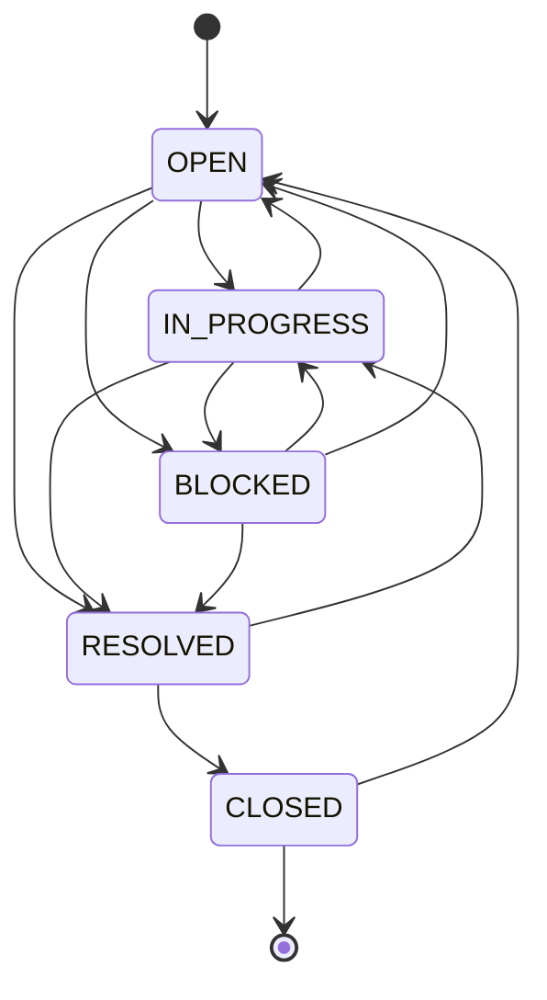

# ACME Facility Incident Management API

FastAPI backend for the ACME Inc. facility incident management platform,
packaged as a single AWS Lambda behind a Function URL and CloudFront.

## How it deploys

`infra/locals.tf` discovers any folder under `backend/` that contains a
`requirements.txt` and turns it into a Lambda:

| Terraform fact | Value for this service |
| -------------- | ---------------------- |
| Function name  | `coding-workshop-facility-api-{app_id}` |
| Runtime        | `python3.13`, x86_64 |
| Handler        | `function.handler` (Mangum wrapping the ASGI app) |
| Invoke URL     | Lambda Function URL, `authorization_type = NONE` |
| CloudFront     | `ordered_cache_behavior` on `/api/facility-api*` |
| Database       | Aurora Serverless v2 PostgreSQL, credentials injected as `POSTGRES_*` |

CloudFront forwards the full path including `/api/facility-api`, while a direct
Function URL call and the local dev proxy (`bin/proxy-server.js`) do not.
`app/middleware.py` strips the prefix when present, so every route below works
through all three entry points.

```sh
./bin/deploy-backend.sh          # deploy to AWS
./bin/start-dev.sh               # LocalStack + PostgreSQL + React, all local
```

Interactive OpenAPI docs are served at `/docs` (i.e.
`https://{cloudfront}/api/facility-api/docs`).

## Databases

There are two, and nothing in the code chooses between them — `app/config.py`
reads every field from the environment, and Terraform injects a different set
depending on whether it is deploying to AWS or to LocalStack
(`infra/locals.tf`):

| | Deployed (AWS) | Local (LocalStack) |
| --- | --- | --- |
| `POSTGRES_HOST` | Aurora cluster endpoint | `172.17.0.1` (Linux) / `host.docker.internal` |
| `POSTGRES_NAME` | `codingworkshop` | `postgres` |
| `POSTGRES_USER` | `superadmin` | `postgres` |
| `POSTGRES_PASS` | generated by Terraform | `postgres123` |
| TLS (`sslmode`) | `require` | `prefer` |

The two are fully independent stores: the deployed Lambda can reach Aurora
because it shares its security group, while nothing outside that group can — a
laptop or VDI cannot connect to Aurora on 5432 even from inside the same VPC.
That is why local development uses its own PostgreSQL rather than a tunnel.

Both start empty and build their own schema on the first request, so the only
step is loading data. Use the same seeder against each, and both environments
hold the same fixed dataset:

```sh
./bin/seed-database.py                          # deployed (Terraform api_base_url)
./bin/seed-database.py --url http://localhost:3001   # local dev proxy
```

A deterministic fixture is deliberately preferred over copying live data down:
it is repeatable, it cannot drift, and it avoids moving real records onto a
developer machine.

### Running the backend locally

```sh
./bin/start-dev.sh                                    # whole stack
./bin/seed-database.py --url http://localhost:3001    # load demo data
```

`start-dev.sh` brings up PostgreSQL, LocalStack, the backend as a real Lambda
(same Terraform as AWS, same `function.handler` entry point), a CORS proxy on
port 3001 and the React dev server on port 3000. Because the Lambda runs in a
container, it reaches PostgreSQL at the Docker bridge address rather than on
loopback, which is why the script runs PostgreSQL in a container published on
that address.

Point the frontend at it once:

```sh
echo 'VITE_API_URL=http://localhost:3001' > frontend/.env.development.local
```

Two practical notes:

* The local database *name* is a literal in `infra/locals.tf`, not a Terraform
  variable, so via `./bin/start-dev.sh` it is always `postgres`. To use a
  different name, run the app directly under uvicorn — there the environment is
  entirely yours — or change that one line.
* Tests use a **third** database and must never share either of these: the
  suite truncates every table on startup. See the Tests section below.

## Layout

```
backend/facility-api/
├── function.py            # Lambda entry point: Mangum(app)
├── requirements.txt       # discovered by Terraform; also the deploy trigger
└── app/
    ├── config.py          # environment variables -> settings
    ├── database.py        # pooled psycopg connection + schema bootstrap
    ├── schema.sql         # DDL, applied idempotently on cold start
    ├── domain.py          # roles, statuses, the workflow state machine
    ├── models.py          # Pydantic request/response models
    ├── security.py        # password hashing, JWT, RBAC dependencies
    ├── errors.py          # ApiError + the shared error envelope
    ├── middleware.py      # /api/{service} prefix handling
    ├── main.py            # app assembly, exception handlers, service routes
    └── routers/
        ├── auth.py        # register / login / me
        ├── users.py       # account administration
        ├── facilities.py  # buildings -> floors -> seats
        ├── engineers.py   # engineer profiles and capacity
        ├── incidents.py   # incidents, workflow, assignment, notes
        └── dashboard.py   # summary, hotspots, SLA, workload
```

Every route carries a comment block above it showing the exact request and
response JSON, plus the status codes it can return.

Tests live at the repository root in `tests/`, deliberately outside `backend/`:
they are not shipped in the Lambda package, and the `bandit -r ./backend`
security workflow does not trip over their `assert` statements.

## Personas and access

| Capability | Employee | Engineer | Facility admin |
| ---------- | :------: | :------: | :------------: |
| Register, log in | ✓ | ✓ | ✓ |
| Report an incident | ✓ | ✓ | ✓ |
| See incidents | own only | assigned + unassigned | all |
| Edit an incident | own, while `OPEN` | assigned | any |
| Change priority | request only | assigned | any |
| Assign work | – | self-assign | anyone |
| Drive the workflow | close/reopen own resolved | assigned | any |
| Escalate | own | assigned | any (and can clear) |
| Internal notes | – | ✓ | ✓ |
| Facilities & engineer CRUD | – | – | ✓ |
| Delete incidents, manage users | – | – | ✓ |

The first account registered against an empty database becomes the facility
admin, so a fresh deployment is usable with no seeded credentials. Every later
registration is an employee, and admins promote from there. Registration is
restricted to `@acme.inc` addresses.

## Endpoints

| Method | Path | Purpose |
| ------ | ---- | ------- |
| GET | `/` | Service metadata |
| GET | `/health` | Liveness plus a PostgreSQL round-trip |
| GET | `/workflow` | Status graph for the workflow diagram |
| POST | `/auth/register` | Register an ACME employee |
| POST | `/auth/login` | Exchange credentials for an access + refresh token pair |
| POST | `/auth/refresh` | Trade a refresh token for a fresh pair (rotates) |
| POST | `/auth/logout` | Revoke one refresh token |
| POST | `/auth/logout-everywhere` | Revoke every refresh token for the account |
| GET | `/auth/me` | Current profile |
| GET | `/users` | List accounts (admin) |
| PATCH | `/users/{id}/role` · `/status` | Promote, demote, deactivate (admin) |
| GET POST | `/buildings` | List / create buildings |
| GET PUT DELETE | `/buildings/{id}` | Read / update / delete a building |
| GET POST | `/buildings/{id}/floors` | List / add floors |
| GET PUT DELETE | `/floors/{id}` | Read / update / delete a floor |
| GET POST | `/floors/{id}/seats` | List / add seats |
| GET PUT DELETE | `/seats/{id}` | Read / update / delete a seat |
| GET POST | `/engineers` | List engineers with workload / create a profile |
| GET PUT DELETE | `/engineers/{id}` | Read / update / delete a profile |
| GET POST | `/incidents` | Search+filter / report |
| POST | `/incidents/duplicate-check` | Find existing reports of a draft's problem |
| GET PUT DELETE | `/incidents/{id}` | Read / update / delete |
| POST | `/incidents/{id}/assign` | Assign or unassign an engineer |
| POST | `/incidents/{id}/status` | Drive the workflow |
| POST | `/incidents/{id}/escalate` | Raise or clear an escalation |
| GET POST | `/incidents/{id}/notes` | Read / add ticket notes |
| GET | `/incidents/{id}/related` | Incidents that look like the same fault |
| GET | `/dashboard/summary` | Counts by status, priority, category |
| GET | `/dashboard/hotspots` | Buildings / floors / seats with recurring issues |
| GET | `/dashboard/sla` | Acknowledge, assign, resolve and close timings |
| GET | `/dashboard/engineers` | Work distribution across engineers (admin) |

## Demo data

```sh
./bin/seed-database.py            # uses the Terraform api_base_url
```

Seeds 3 buildings / 8 floors / 21 seats, 11 accounts across the three personas,
and 24 incidents driven through the real workflow. It is idempotent and talks to
the API rather than PostgreSQL, because Aurora is only reachable from inside its
own security group. See `bin/README.md` for details and the known limitation
around SLA timestamps.

## Asynchronous notifications

Telling everyone about a change is fan-out: one status change can concern the
reporter, the assigned engineer and every facility admin. Doing that inside the
request would add latency to a workflow transition, and a failure to notify
would fail a state change that has already been agreed.

```
POST /incidents/{id}/status
  -> record the transition, then one cheap insert into notification_events
notification_events (an outbox)
  -> expanded into a row per recipient, off the causing request, by either
     backend/notifier (whole backlog) or a bounded drain when someone reads
     their feed
GET /notifications  ->  the bell in the app bar
```

**Why an outbox rather than a queue.** SQS with an event source mapping is the
usual answer, and an asynchronous Lambda invocation the usual fallback. Neither
works here, and the reasons are worth recording:

* `lambda:CreateEventSourceMapping` acts on an `event-source-mapping:*` ARN,
  while the deployment policy grants `lambda:*` only on
  `function:coding-workshop*`. The mapping cannot be created.
* The functions run in a VPC with **no NAT gateway** and no interface endpoint
  for Lambda or SQS, so an in-VPC function cannot reach either control-plane
  API — a call hangs until the request times out with a 504. Adding an endpoint
  needs `ec2:CreateVpcEndpoint`, which is denied.

The database is the only thing always reachable, so it carries the handoff.
Events are claimed with `FOR UPDATE SKIP LOCKED`, so the worker and any API
container draining concurrently never process the same event twice and never
block one another. An event that can never render — an unknown type, or an
incident since deleted — is marked processed rather than retried, and
`attempts` caps anything that fails repeatedly.

The person who caused the change is not notified about their own action, and
internal notes are not announced, since employees cannot see them.

## Incident workflow



`GET /workflow` returns the same graph as data, so the React app can render it
without hard-coding the rules. Blocking requires a `reason` and resolving
requires a `resolution`; both are appended to the ticket's notes, and the
`acknowledged_at` / `assigned_at` / `resolved_at` / `closed_at` stamps feed
`GET /dashboard/sla`.

## Duplicate detection

Twelve tickets for one broken air conditioner is a facility desk's worst
failure mode: each is triaged, assigned and chased separately, and the
dashboards report a crisis that is not happening. `POST
/incidents/duplicate-check` answers "is this already reported?" while the
reporter is still typing, and `GET /incidents/{id}/related` runs the same
ranking against an incident that already exists.

`app/duplicates.py` scores every open candidate on three signals:

| Signal | Weight | Why it is there |
| ------ | ------ | --------------- |
| Text | 0.50 | `GREATEST(word_similarity, similarity)` from `pg_trgm`. People misspell ("projecter"), abbreviate ("AC") and re-word; full-text search stems a typo to itself and matches nothing. Taking the larger of the two metrics keeps the score stable whether the reporter has typed four words or forty. |
| Category | 0.30 | What separates "AC leaking on level 2" from "Emergency exit light out on level 2". On text alone those two score *identically*, because they share "level 2". |
| Location | 0.20 | Same seat (1.0) beats same floor (0.7) beats same building (0.4). |

Candidates are gathered by a recall gate - a full-text match on any word, or
enough trigram overlap to be worth scoring - then filtered at **0.55**. The
weights and that threshold were fitted against a hand-labelled fixture of
realistically worded reports in `tests/test_duplicates.py`, where true
duplicates scored 0.66-0.80 and unrelated incidents 0.06-0.44. A prompt that
fires on unrelated incidents is worse than no prompt at all, because people
learn to dismiss it unread.

Closed incidents are out of scope; resolved ones are not, since "the same fault
came back" is worth surfacing.

**Disclosure.** Matches ignore the caller's visibility, because the feature
exists precisely to tell an employee that *somebody else* already reported the
fault - which the normal scoping would never let them see. What a match
discloses is therefore deliberately narrow: id, title, category, priority,
status, location and age, with no description and no reporter. Each match
carries `visible`, saying whether the caller may open the full record, so the
UI can avoid offering a link that would 404.

**`pg_trgm` is optional.** `schema.sql` creates the extension inside a `DO`
block that swallows a privilege error, because an uncaught one there would
abort the whole schema bootstrap on cold start and take the service down over a
ranking nicety. The module probes for the functions once and falls back to
full-text-only ranking when they are missing - fewer duplicates found, no
errors.

## Sessions and token refresh

Login returns two credentials with deliberately different lifetimes:

| Token | TTL | Where it lives | Revocable |
| ----- | --- | -------------- | --------- |
| `access_token` | 30 min (`ACCESS_TOKEN_TTL_MINUTES`) | Nowhere — it is only a signature | No |
| `refresh_token` | 7 days (`REFRESH_TOKEN_TTL_DAYS`) | `refresh_tokens`, hashed | Yes |

The access token is short precisely *because* it cannot be revoked: it is
verified from its signature alone, without touching the database, so the only
thing limiting the damage of a leaked one is how soon it expires. The refresh
token is the long-lived credential, and that one is a database row that can be
deleted.

`POST /auth/refresh` **rotates**: the presented token is marked spent and a new
pair is issued. Each row records the token it replaced, so the tokens issued to
one login form a chain. Presenting a token that was already spent is only
possible if it was copied, so that request revokes the entire chain — the
attacker's stolen token and the victim's live session both stop working — and
returns `401 token_reused`. The alternative, revoking just the replayed token,
lets whoever refreshes first keep the account.

`POST /auth/logout` revokes a single token and answers `204` whether or not the
token existed, so a client that has already lost its token can still log out
cleanly. `POST /auth/logout-everywhere` clears every token for the account,
which is what a user wants after losing a laptop.

## Error format

Every non-2xx response uses one envelope:

```json
{
  "error": {
    "status": 400,
    "type": "validation_error",
    "message": "Request payload failed validation",
    "details": [{ "field": "body.email", "message": "email must belong to the @acme.inc domain" }]
  }
}
```

| Status | Typical `type` |
| ------ | -------------- |
| 400 | `validation_error`, `engineer_unavailable`, `engineer_at_capacity` |
| 401 | `not_authenticated`, `invalid_credentials`, `invalid_token`, `token_expired`, `token_reused` |
| 403 | `forbidden`, `account_disabled`, `last_admin`, `self_deactivation` |
| 404 | `not_found` (also returned instead of 403 so ids are not enumerable) |
| 409 | `conflict`, `invalid_transition`, `incident_closed` |
| 503 | `database_unavailable` |

## Security notes

* Passwords are PBKDF2-HMAC-SHA256 (240k iterations, per-user salt) from the
  standard library, so the Lambda package needs no native crypto wheels.
* Access tokens are stateless HS256 JWTs. The signing key comes from
  `JWT_SECRET` when set; otherwise it is derived deterministically from the
  deployment's own identifiers so all containers agree. **Set `JWT_SECRET`
  explicitly outside the workshop** by adding it to `local.env_vars` in
  `infra/locals.tf`.
* Refresh tokens are 256-bit random strings stored as SHA-256 digests, never in
  the clear. A slow KDF would be pointless here: unlike a password, the token
  has full entropy, so there is no guessable input for an attacker to grind.
* All SQL runs through psycopg parameter binding. The handful of f-string
  queries interpolate only module-level identifiers, never client input; those
  lines carry a `# nosec B608` with that justification so the Bandit workflow
  stays green.

## Continuous deployment

`.github/workflows/backend.deploy.yml` runs on any push to `main` touching
`backend/**`, `tests/**` or `infra/**`. It runs the pytest suite against a
throwaway PostgreSQL service container plus the Bandit scan, and only on success
runs `./bin/deploy-backend.sh aws`, finishing with a health-check on
`/api/facility-api/health`.

`.github/workflows/frontend.deploy.yml` does the same for `frontend/**`, gating
`./bin/deploy-frontend.sh aws` on lint, `npm audit` and a production build.

**Not CodePipeline.** The participant IAM policy in `infra/policy.tftpl` is an
allow-list covering fifteen services, none of them `codepipeline`, `codebuild`
or `codeconnections`; every call to those APIs returns `AccessDenied`. A
pipeline cannot be created with these credentials, so CI uses GitHub Actions,
which this repository already relies on for its security checks.

**Repository secrets** the deploy jobs need:

| Secret | Purpose |
| --- | --- |
| `PARTICIPANT_ID` | Your participant id, e.g. `0922f9b2` |
| `PARTICIPANT_CODE` | The code from your workshop email |
| `EVENT_ID` | Workshop event id (optional; defaults to `abcd1234`) |
| `PARTICIPANT_URL` | Optional; set it to skip the DNS lookup |

No long-lived AWS keys are stored. The workflow runs `bin/setup-participant.sh`,
which exchanges `PARTICIPANT_CODE` for short-lived credentials at run time —
the same path used locally. When these secrets are absent the deploy job skips
itself with a notice and the test job still runs, so forks stay green.

## Tests

The suite opens by truncating every table, so it must point at a database of
its own — never the local development database and never Aurora:

```sh
docker run -d --rm --name acme-test-db \
    -e POSTGRES_PASSWORD=devtest -e POSTGRES_DB=acmetest -p 55432:5432 postgres:17-alpine

pip install -r backend/facility-api/requirements.txt pytest httpx
POSTGRES_HOST=127.0.0.1 POSTGRES_PORT=55432 POSTGRES_NAME=acmetest \
POSTGRES_USER=postgres POSTGRES_PASS=devtest IS_LOCAL=true \
    pytest tests -v
```

A throwaway container is the safest target: it starts clean every time, matches
the Aurora major version, and cannot reach either real database.

Note on Bandit: `./bin/start-dev.sh` vendors this service's pip requirements
into `backend/facility-api/` so the LocalStack Lambda can import them, which
makes a local `bandit -r ./backend` scan third-party packages and report
hundreds of findings in code you did not write. Those paths are git-ignored, so
CI — which starts from a clean checkout — is unaffected. To reproduce CI
locally, scan a tree without the vendored packages.

Run from the repository root. `tests/test_facility_api.py` exercises
registration and RBAC, facility CRUD, the full incident lifecycle, escalation,
note visibility, engineer capacity limits and the dashboard aggregates.
`tests/test_lambda_handler.py` invokes `function.handler` with real Lambda
Function URL (payload format 2.0) events, covering the Mangum translation and
the CloudFront prefix handling that the ASGI-level tests cannot reach.

`tests/test_duplicates.py` is different in kind. Alongside the usual contract
checks it carries a hand-labelled fixture of realistically worded reports —
including a misspelling and a pair that share a floor and the phrase "level 2"
while being unrelated faults — and asserts that every true duplicate outranks
every distractor. Weights and thresholds cannot be tuned honestly without it.
One test deliberately runs the same misspelled query with `pg_trgm` disabled to
show that the trigram path, not something incidental, is what finds it.
